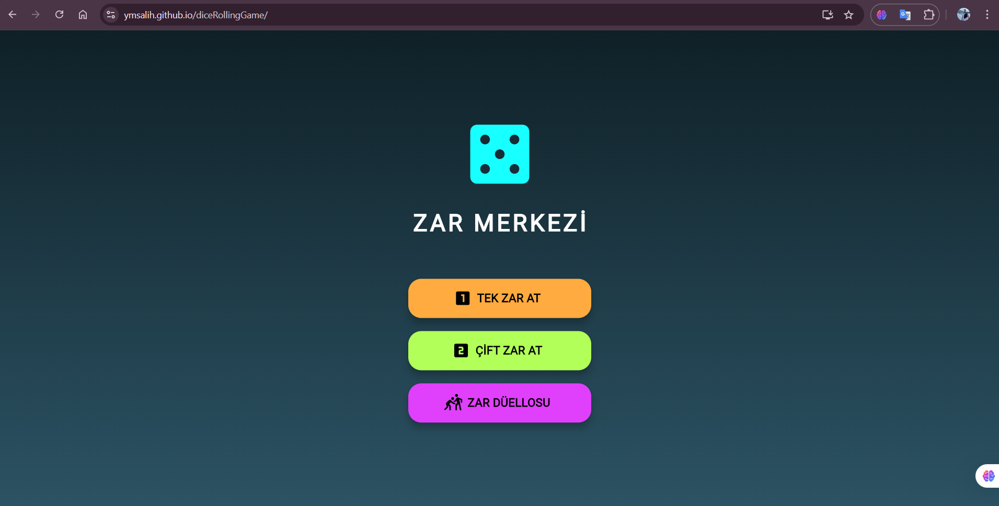
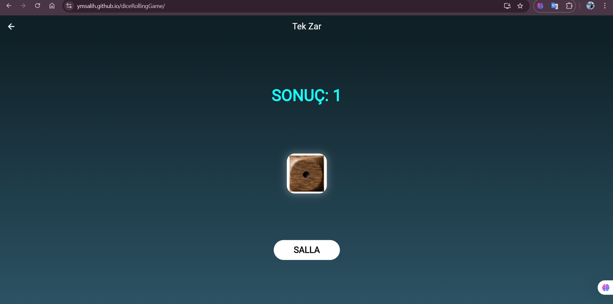
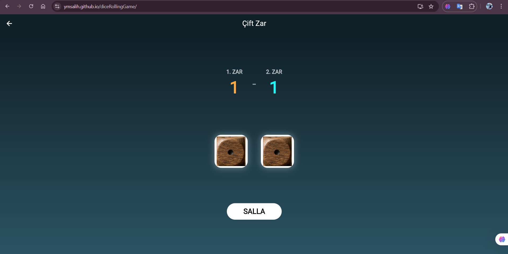
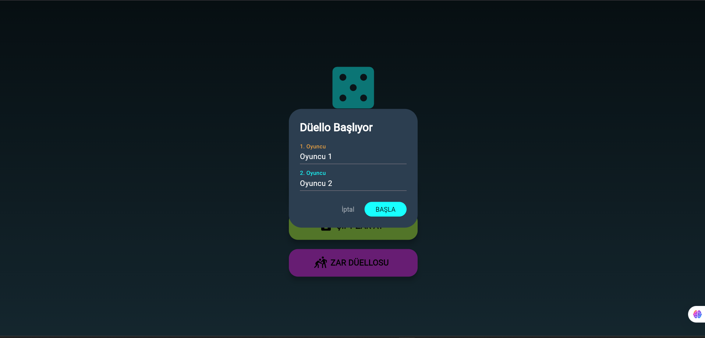
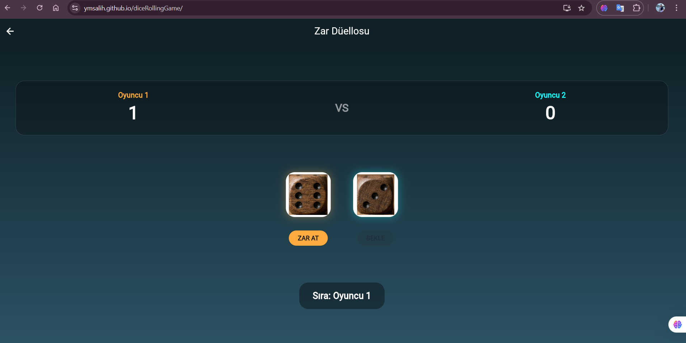

# 🎲 Zar Arena (Dice Rolling Game)

[](https://flutter.dev/)
[](https://dart.dev/)
[](#)

Zar Arena, Flutter altyapısı kullanılarak **tek bir kod tabanından hem Web hem de Mobil (Android)** platformları için geliştirilmiş modern bir zar atma uygulamasıdır. Akıcı animasyonlar, gür ses efektleri ve rekabetçi oyun modları ile tam bir tam ekran (immersive) deneyimi sunar.

---

## 🚀 Canlı Deneyim & İndirme

Projenin hem tarayıcı üzerinden çalışan web sürümüne hem de Android cihazlar için derlenmiş APK dosyasına aşağıdan ulaşabilirsiniz:

🌐 **Web Sürümü (Canlı Oyna):** [Zar Arena Web Demo](https://ymsalih.github.io/diceRollingGame/)  
*(Not: Tarayıcı politikaları gereği seslerin aktif olması için ekrana bir kez tıklamanız gerekebilir.)*

📱 **Android Sürümü (APK):** Depodaki `build/app/outputs/flutter-apk/app-release.apk` dizininden uygulamanın güncel Android sürümünü indirip telefonunuza kurabilirsiniz.

---

## 📸 Ekran Görüntüleri

<p align="center">
  
  
  
   
    
</p>

---

## ✨ Öne Çıkan Özellikler

* **Çapraz Platform (Cross-Platform):** Dart diliyle yazılan tek bir mimari üzerinden web (`gh-pages`) ve mobil (APK) çıktıları.
* **Gelişmiş Oyun Modları:** * *Tek Zar & Çift Zar:* Bireysel kullanım veya masa oyunları için serbest atış modları.
  * *Zar Düellosu:* İki oyuncunun karşılıklı zar attığı, anlık skor takibinin yapıldığı rekabetçi mod.
* **Fiziksel Hissiyat:** `audioplayers` paketi ile entegre edilmiş gerçekçi zar çarpma sesleri.
* **Dinamik UI/UX:** `AnimationController` kullanılarak tasarlanan sıçrama (bounce), dönme (rotation) ve ölçekleme (scale) efektleri.
* **Sürekli Entegrasyon (CI/CD):** GitHub Actions kullanılarak, `main` dalına yapılan her push işleminde web sürümünün otomatik derlenip yayına alınması.

---

## 🛠️ Kurulum ve Derleme Rehberi

Projeyi kendi ortamınızda çalıştırmak veya farklı platformlar için derlemek isterseniz aşağıdaki adımları izleyebilirsiniz.

### 1. Projeyi Klonlayın
```bash
git clone [https://github.com/ymsalih/diceRollingGame.git](https://github.com/ymsalih/diceRollingGame.git)
cd diceRollingGame
flutter pub get

ürünleri Derleme (Build İşlemleri)
Android (APK) İçin:
Bash
flutter build apk --release
Web Sitesi İçin:
Bash
flutter build web --release --base-href "/diceRollingGame/"

Kullanılan Teknolojiler
Framework: Flutter
Dil: Dart
Paketler: audioplayers (Ses yönetimi)
DevOps: GitHub Actions, GitHub Pages